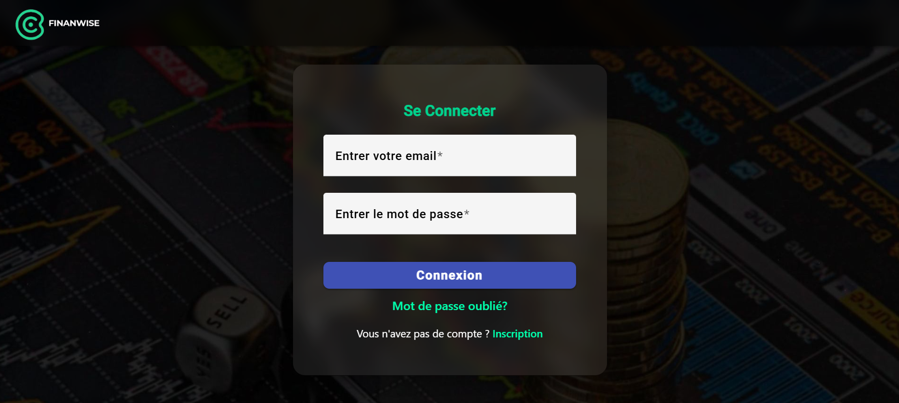
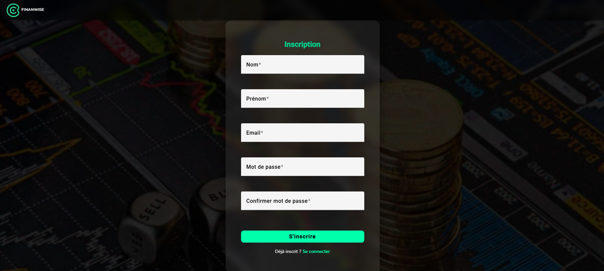
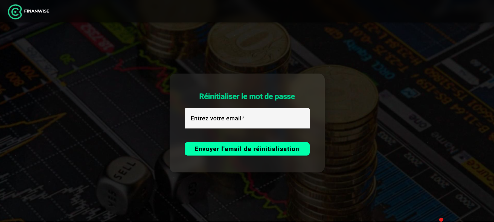
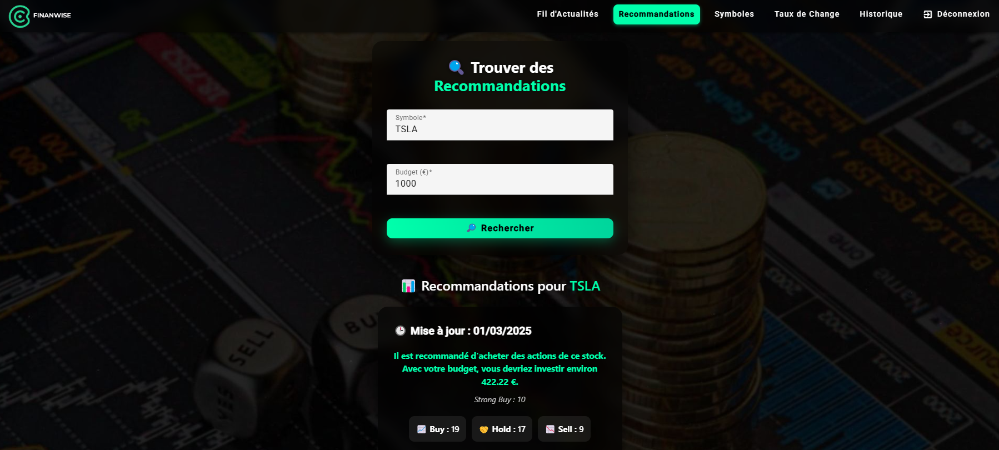
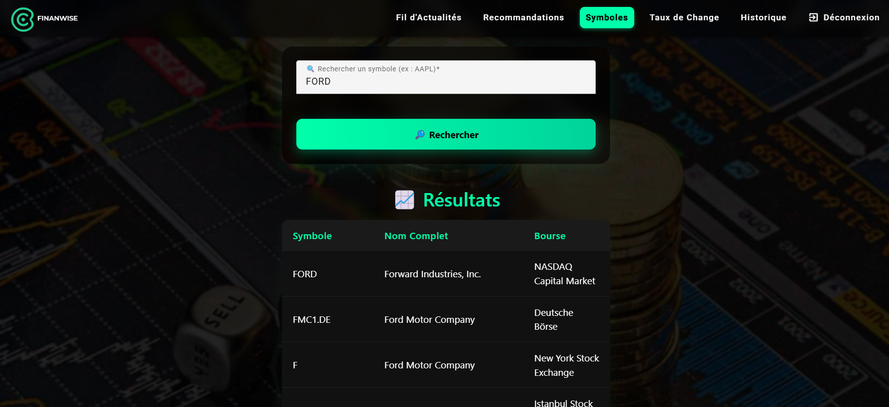
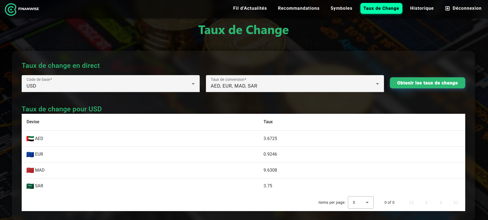
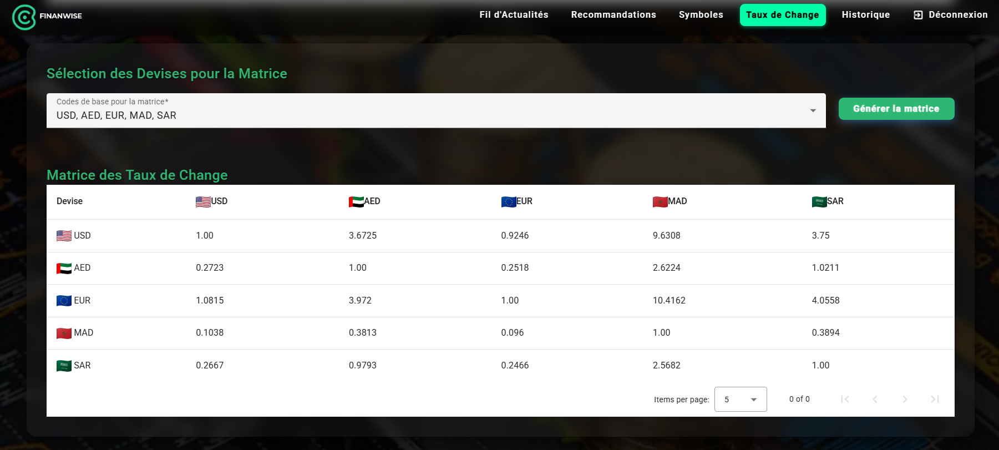
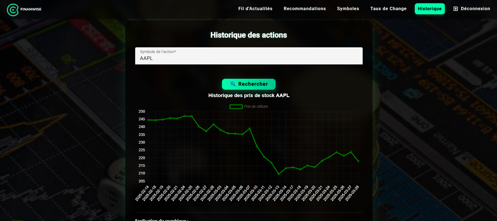

# 🚀 FINANWISE

## 📌 Description
Finanwise est une application web intuitive qui permet d'identifier et de stocker des opportunités d'investissement adaptées au budget des utilisateurs grâce à des API intelligentes, telles que Finnhub et Yahoo Finance via RapidAPI, tout en proposant des outils financiers avancés comme l’historique des prix des actions ou les taux de change. Construite avec **Angular**, elle s’appuie sur des technologies modernes pour offrir une expérience utilisateur fluide et performante.

---

## Aperçu de l'Interface 🖼️

Voici quelques captures d'écran de l'interface utilisateur de **Finanwise** :

- **Page de Connexion**  
  

- **Inscription**  
  

- **Réinitialisation du Mot de Passe**  
  

- **Fil d'Actualités Financières**  
  
  
- **Recommandations d'Investissement**  
  

- **Recherche de Symboles Boursiers**  
  

- **Taux de Change en Direct**  
  

- **Matrice des Taux de Change**  
  

- **Historique des Actions**  
  

---

## Lien de l'Application 🌐

Vous pouvez accéder à l'application Finanwise ici : [Finanwise](https://finanwise-c4784.web.app/login)

---

## 📜 Table des Matières

- [Fonctionnalités](#fonctionnalit%C3%A9s)
- [Prérequis](#pr%C3%A9requis)
- [Installation](#installation)
- [Utilisation](#utilisation)
- [Déploiement](#d%C3%A9ploiement)
- [Structure du projet](#structure-du-projet)
- [Technologies utilisées](#technologies-utilis%C3%A9es)
- [Contributeurs](#contributeurs)
- [Licence](#licence)

---

## 🎯 Fonctionnalités ✨

- **Historique des prix des actions** : Graphiques interactifs des prix de clôture 📈
- **Taux de change** : Conversion en temps réel entre devises 💱
- **Matrice des taux de change** : Comparaison visuelle de plusieurs devises 🌍
- **Recherche de symboles boursiers** : Exploration et sélection pour recommandations 🔍
- **Recommandation d'investissement** : Gestion des recommandations via le composant `stock-recommendation` 📊
- **Interface moderne** : Design épuré avec **Angular Material** 🎨
- **Graphiques dynamiques** : Visualisations avancées via **Chart.js** 📉
- **Authentification** : Connexion et inscription des utilisateurs 🔒
- **Articles financiers** : Liste d’articles et d’actualités sur les marchés 📚
- **Gestion des utilisateurs** : Système de récupération de mot de passe 🛡️

---

## Prérequis ⚙️

Pour démarrer, assurez-vous d’avoir installé :

- **Node.js** : Version 16+ recommandée 💻
- **Angular CLI** : Version 15+ 🚀
- **npm** ou **yarn** : Gestionnaire de paquets 📦
- **Compte Firebase** : Pour l'authentification et l’hébergement 🔑

---

## 📥 Installation ⚡

1. Clonez le dépôt :
   ```bash
   git clone https://github.com/Mehdi-Elargoubi/FINANWISE.git
   cd finanwise
   ```

2. Installez les dépendances :
   ```bash
   npm install
   ```

3. Configurez les clés API dans les Services ⚙️

---

## 🚀 Utilisation 🖥️

1. Démarrez le serveur de développement :
   ```bash
   ng serve
   ```

2. Accédez à l’application dans votre navigateur :
   ```
   http://localhost:4200
   ```

3. Découvrez les outils : historique des actions, taux de change, recommandations, etc. 💡

---

## Déploiement 🚀

Voici les étapes pour déployer l'application **Finanwise** en production :

### 1. Préparer le projet pour la production 🛠️

Construisez le projet Angular en mode production :

```bash
ng build --prod
```

Cela génère les fichiers de production dans le dossier `dist/finanwise`.

### 2. Hébergement avec Firebase 🌍

#### Installer Firebase CLI

Si ce n'est pas déjà fait, installez l'outil Firebase CLI globalement :

```bash
npm install -g firebase-tools
```

#### Se connecter à Firebase

Connectez-vous à votre compte Firebase :

```bash
firebase login
```

#### Initialiser Firebase dans le projet

Initialisez Firebase Hosting dans votre projet :

```bash
firebase init
```

- Sélectionnez **Hosting**.
- Choisissez le dossier `dist/finanwise` comme répertoire public.
- Configurez comme application à page unique (SPA) en répondant "Yes" à la question correspondante.

#### Déployer sur Firebase

Une fois le projet construit, déployez-le sur Firebase Hosting :

```bash
firebase deploy
```

#### Accéder à l'application

Une fois le déploiement terminé, Firebase fournit une URL où votre application est hébergée. Vous pouvez y accéder directement via cette URL. 🌐

---

## 📂 Structure du projet 🏗️

```
finanwise/
├── src/
│   ├── app/
│   │   ├── components/
│   │   │   ├── exchange-rates/       # Taux de change
│   │   │   ├── stock-history/        # Historique des actions
│   │   │   ├── stock-recommendation/ # Recommandations
│   │   │   ├── stock-search/         # Recherche boursière
│   │   │   ├── navbar/               # Barre de navigation
│   │   │   ├── footer/               # Pied de page
│   │   │   ├── login/                # Connexion
│   │   │   ├── register/             # Inscription
│   │   │   ├── article-list/         # Liste des articles
│   │   │   ├── forgot-password/      # Mot de passe oublié
│   │   ├── services/
│   │   │   ├── exchange-rate.service.ts
│   │   │   ├── stock-history.service.ts
│   │   │   ├── stock-search.service.ts
│   │   │   ├── recommendation.service.ts
│   │   │   └── auth.service.ts       # Service d'authentification
│   │   ├── models/
│   │   │   ├── stock.ts              # Modèle pour les données boursières
│   │   │   ├── news.model.ts         # Modèle pour les articles
│   │   │   ├── recommendation.ts     # Modèle pour les recommandations
│   │   │   ├── user.model.ts         # Modèle pour les utilisateurs
│   │   ├── app-routing.module.ts     # Configuration des routes
│   │   ├── app.module.ts             # Module principal
│   │   └── app.component.ts          # Composant racine
│   ├── assets/
│   │   ├── images/                   # Images utilisées dans l'application
│   │   ├── styles/                   # Fichiers CSS globaux
│   │   └── favicon.ico
│   ├── styles.css                    # Styles globaux
│   ├── index.html                    # Fichier HTML principal
│   ├── main.ts                       # Point d'entrée principal
│   ├── tsconfig.app.json             # Configuration TypeScript pour l'application
├── angular.json                      # Configuration Angular CLI
├── package.json                      # Dépendances du projet
├── firebase.json                     # Configuration Firebase Hosting
├── tsconfig.json                     # Configuration TypeScript globale
├── tslint.json                       # Configuration TSLint
└── README.md                         # Documentation du projet
```

---

## 🛠 Technologies Utilisées 💻

- **Framework** : Angular 🚀
- **Interface** : Angular Material 🎨
- **Graphiques** : Chart.js 📉
- **API** : Services tiers (données boursières, taux de change) 🌐
- **Backend** : Firebase Authentication & Firestore 🔑
- **Hébergement** : Firebase Hosting 🌍
- **Langage** : TypeScript 💻
- **Dépendances** : npm 📦

---

## Licence 📜

Ce projet est sous licence [MIT](LICENSE).
